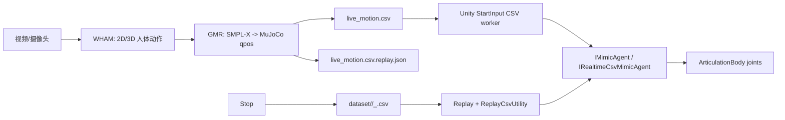

# Imitation 项目代码走读

本文是当前项目的维护入口。内容按现有功能基线整理：Unity 侧负责 UI、实时 CSV 接入、离线回放、机器人显隐和 ArticulationBody 驱动；`Robot-imitation-learning/` 负责 WHAM 视频/摄像头识别和 GMR 机器人 IK 输出。

## 当前功能基线

- 支持 Unity 场景：`G1.unity`、`G1Replay.unity`。
- Unity UI 使用运行时生成的 `RetargetingHudLayout` HUD：左侧机器人/CSV/Start/Replay/Stop，右侧 WHAM/GMR/PARAMS。
- 支持机器人 key：
  - `unitree_g1`：36 列 CSV，29 DOF。
  - `unitree_h1`：26 列 CSV，19 DOF。
  - `x02lite`：25 列 CSV，18 DOF。
  - `openloong`：38 列 CSV，31 DOF。
  - `lite_11_v1`：19 列 CSV，仅后端适配。
- 实时重定向 Stop 后会把实时 CSV 按 `yyyyMMdd_HHmmss_robot.csv` 归档进对应 `dataset/<robot>/`，并写 `.csv.replay.json` 记录源 FPS。
- 离线 replay 会读取 `.replay.json` 的 FPS 元数据，把源帧率重采样到 Unity 50 Hz，避免摄像头实时 CSV 离线播放快进。

## 总体数据流



## Unity 侧模块

### `RobotCatalog`

`Scripts/RobotCatalog.cs` 是机器人 key 的唯一常量入口。

| 函数/字段 | 作用 |
| --- | --- |
| `SupportedPipelineKeys` | WHAM/GMR 可启动的机器人 key。 |
| `PrimaryDisplayOrder` | Unity HUD 中多机器人显示顺序。 |
| `TryNormalizeKey()` | 把 `G1`、`H1`、`X02Lite`、`lite11` 等别名归一化成后端 key。 |
| `NormalizeKeyOrOriginal()` | 能归一化就返回 key，不能归一化就保留原字符串，供文件夹匹配使用。 |
| `TryGetDatasetFolder()` | key -> `dataset` 子目录，例如 `unitree_h1` -> `unitree_h1`。 |
| `GetDatasetFolderOrKey()` | 找不到专用目录时回退到 key 本身。 |
| `TryGetExpectedCsvColumns()` | 返回各机器人 CSV 列数，用于下拉过滤和数据校验。 |

### `StartInput` 主类

`StartInput` 是 Unity 和 Python pipeline 的桥。它现在拆为 partial，类名和序列化字段保持不变。

| 文件 | 主要职责 |
| --- | --- |
| `Scripts/StartInput.cs` | Inspector 字段、公开入口、Unity 生命周期、Start/Stop 按钮入口。 |
| `Scripts/StartInput.Logging.cs` | pipeline 日志分级、启动进度、debug log writer。 |
| `Scripts/StartInput.RobotSelection.cs` | 机器人勾选、显隐、运行时 collider proxy、多机器人展示偏移。 |
| `Scripts/StartInput.Archive.cs` | Stop 后实时 CSV 归档、时间戳命名、FPS metadata 写入、CSV 文件清理。 |
| `Scripts/StartInput.Process.cs` | `run.ps1/run.sh` 启动、环境变量、进程树终止、路径解析。 |
| `Scripts/StartInput.CsvMonitor.cs` | 单/多机器人 CSV worker、增量读取、FPS 估计、安全门、实时行分发。 |
| `Scripts/StartInput.Resolve.cs` | 当前机器人/Agent/按钮/下拉引用解析。 |

关键函数索引：

| 函数 | 调用方 | 作用 |
| --- | --- | --- |
| `Awake()` | Unity | 清 transient 状态、绑定 Start 按钮、绑定 RoboList 下拉。 |
| `Start()` | Unity coroutine | 下一帧应用初始机器人选择，避免场景对象尚未注册。 |
| `Update()` | Unity | 消费 CSV 队列、刷新归档后的下拉、输出日志队列。 |
| `OnDestroy()` / `OnApplicationQuit()` | Unity | 停 CSV worker、停 Python 进程、停 debug writer。 |
| `OnStartButtonClicked()` | HUD/Button | 启动 Python pipeline，并启动实时 CSV monitor。 |
| `StopStartPipeline(bool archiveRealtimeCsv)` | `Stop` | 停 pipeline；为 true 时归档实时 CSV。 |
| `SetRobotSelected()` | HUD Toggle | 维护勾选集合，并同步场景机器人显隐和相机目标。 |
| `RegisterRobotCsvBrowser()` | HUD CSV dropdown | 注册每个机器人自己的 CSV 下拉。 |
| `TryGetSelectedCsvForRobot()` | `Replay` | 取得指定机器人当前选中的 CSV 路径。 |
| `StartOrRestartBashProcess()` | Start | 解析工作目录、环境变量和脚本路径，启动 WHAM/GMR。 |
| `StopBashProcessAsync()` / `StopBashProcessBlocking()` | Stop/退出 | Windows 用 `taskkill /T`，Linux 用进程组 kill。 |
| `StartCsvMonitor()` | Start | 根据勾选机器人启动单/多 CSV worker。 |
| `CsvWorkerLoop()` | worker thread | 轮询 CSV 文件，读取新增完整行，估计 producer FPS。 |
| `ApplyRealtimeCsvRows()` | 主线程 | 启动 agent realtime 模式，设置播放 FPS/缓冲并追加行。 |
| `FilterSafeRealtimeCsvRows()` | 主线程 | 拒绝 root/joint 跳变过大的坏行。 |
| `BuildRealtimeCsvArchiveRequests()` | Stop | 收集各机器人实时 CSV 和源 FPS。 |
| `ArchiveRealtimeCsvOutputs()` | Stop/background | 拷贝或按摄像头实时 FPS 重采样为 30 fps，再写入 dataset。 |
| `ResolveActiveAgent()` / `ResolveAgentByRobotKey()` | Start/CSV | 从 `MimicAgentRegistry` 找当前机器人 agent，避免误路由。 |

### HUD：`RetargetingHudLayout`

HUD 是运行时生成式 UI，避免手动 Canvas 对象反复膨胀。类名和 helper MonoBehaviour 保持不变。

| 文件 | 主要职责 |
| --- | --- |
| `Scripts/RetargetingHudLayout.cs` | 自动 bootstrap、Canvas 归一化、HUD root 创建。 |
| `Scripts/RetargetingHudLayout.Controls.cs` | 左侧控制面板、机器人勾选、每机器人 CSV dropdown。 |
| `Scripts/RetargetingHudLayout.Drawers.cs` | 右侧 WHAM/GMR/PARAMS 抽屉、参数控件。 |
| `Scripts/RetargetingHudLayout.Style.cs` | 按钮、dropdown 样式、Start/Replay/Stop 调用。 |
| `Scripts/RetargetingHudLayout.Runtime.cs` | 每帧同步按钮锁定、进度条、视频流状态、抽屉显示。 |
| `Scripts/RetargetingHudLayout.Helpers.cs` | RectTransform/Canvas/EventSystem/旧 HUD 清理等 helper。 |

关键函数索引：

| 函数 | 作用 |
| --- | --- |
| `Bootstrap()` / `EditorBootstrap()` | Play/Edit 模式下为 imitation scene 创建 HUD host。 |
| `Build()` | 找 Canvas、设置 Overlay/Scaler、清理泄漏 HUD、创建 root。 |
| `BuildControlDock()` | 左侧 Home、标题、机器人行、Start/Replay/Stop、相机按钮。 |
| `CreateRobotToggle()` | 勾选机器人，回调 `StartInput.SetRobotSelected()`。 |
| `CreateRobotCsvDropdown()` | 为单个机器人创建 CSV 下拉并注册给 `StartInput`。 |
| `BuildPluginDock()` | 右侧 WHAM/GMR/PARAMS 按钮。 |
| `CreateVideoDrawer()` | 创建可拖动 WHAM/GMR 预览窗口。 |
| `CreateParamsDrawer()` / `BuildParamsContent()` | 反射 `StartInput` runtime 参数并生成输入框/开关。 |
| `CreateInputField()` | 创建 TMP input field，使用 TMP 原生 caret/selection。 |
| `SyncRealtimeUiState()` | pipeline 启动中锁定 Start/Replay/dropdown，保留 Stop。 |
| `UpdateProgressPanel()` | 显示启动进度和错误。 |
| `BindStreamReceiverTargets()` | 把 WHAM/GMR RawImage 绑定到 TCP stream receiver。 |
| `ShowDrawer()` / `HideDrawer()` | 控制右侧抽屉显示和 raycast。 |
| `DestroyLeakedGeneratedHudChildren()` | 清理历史生成的 HUD 子对象，防止 Canvas 下 GameObject 泛滥。 |

### Replay / Stop / FileBrowser

| 文件 | 函数 | 作用 |
| --- | --- | --- |
| `Scripts/Replay.cs` | `OnReplayButtonClicked()` | 按当前勾选机器人批量 replay。 |
|  | `TryReplaySelectedRobots()` | 每个机器人拿自己的 dropdown CSV，调用 agent。 |
|  | `ResolveCsvAbsolutePath()` | 从 dropdown 名称解析实际 CSV 路径。 |
|  | `ResolveReplayDatasetPath()` | 基于 `RobotCatalog` 找机器人 dataset 目录。 |
| `Scripts/Stop.cs` | `OnStopButtonClicked()` | 绑定按钮入口。 |
|  | `ExecuteStop()` | 调 `StartInput.StopStartPipeline(true)` 并 reset agents。 |
|  | `ResetAgent()` | 清 replay/live 状态并同步 neutral/初始姿态。 |
| `Scripts/FileBrowser.cs` | `PopulateDropdown()` | 根据模式填充 dropdown。 |
|  | `PopulateCsvOptions()` | 扫 CSV，按机器人列数过滤。 |
|  | `IsCompatibleWithActiveRobotFilter()` | 使用 `RobotCatalog.TryGetExpectedCsvColumns()` 防止错机器人 CSV 混入。 |
|  | `GetSelectedCsvPath()` | 返回当前 CSV 绝对路径。 |

### CSV / FPS：`ReplayCsvUtility`

| 函数 | 作用 |
| --- | --- |
| `ResampleSourceFpsToFixedHz()` | 离线 replay：任意源 FPS -> Unity 50 Hz。 |
| `ResampleSourceFpsToTargetFps()` | Stop 归档：摄像头实时 FPS -> 30 fps dataset CSV。 |
| `ResolveReplaySourceFps()` / `TryReadReplaySourceFps()` | 读取 `.csv.replay.json`，无 metadata 时默认 30 fps。 |
| `WriteReplayMetadata()` | 写归档 CSV 的源 FPS、机器人 key、列数、创建时间。 |
| `AppendRawRows()` | realtime agent 追加 CSV 行。 |
| `SampleRowsAtFrame()` / `AdvanceRealtimeCursor()` | realtime playback 按 producer FPS 采样。 |
| `InterpolateRootQuaternion()` | 重采样时对 root quaternion 做 slerp。 |

### Agent 注册与相机

| 文件 | 函数 | 作用 |
| --- | --- | --- |
| `Scripts/IMimicAgent.cs` | `IMimicAgent` | replay/live 通用接口。 |
|  | `IRealtimeCsvMimicAgent` | StartInput 增量 CSV 接入接口。 |
|  | `ISelectableMimicAgent` | 显隐/勾选状态通知。 |
|  | `IReplayRootOffsetMimicAgent` | 多机器人并排展示偏移。 |
| `Scripts/MimicAgentRegistry.cs` | `Register()` / `Unregister()` | Agent 生命周期注册。 |
|  | `FindByKey()` | key -> agent。 |
|  | `SetActiveTarget()` | 当前相机跟随/active target。 |
| `Scripts/SelectedRobotCameraFollow.cs` | `SwitchNextView()` | Overview/Front 等相机视角切换。 |
|  | `SwitchNextRobotTarget()` | 只切换相机跟随目标，不控制机器人可见性。 |
|  | `ResolveSelectableRoots()` | 从 `StartInput` 勾选集合和 registry 找相机候选。 |
|  | `UpdateCameraTransforms()` | 根据机器人 bounds 更新相机。 |
| `Scripts/StreamReceiver.cs` | `EnsureReceiverHost()` | 运行时 TCP 图像接收 host。 |
|  | `ConfigureTargets()` | WHAM/GMR RawImage 目标绑定。 |
|  | `GetStatusLine()` | HUD 显示流状态。 |

## 四个 Unity Agent

四个 agent 都实现 `IMimicAgent`，支持 replay/live，但每个机器人有自己的 CSV 列数、关节名、sign/offset 和 neutral 处理。

### `G1mimicAgent.cs`

| 函数 | 作用 |
| --- | --- |
| `Initialize()` | 建关节缓存、显式 G1 关节映射、注册 agent。 |
| `BuildDeterministicG1JointMap()` | 按 MuJoCo/CSV 顺序绑定 29 个 Unity revolute joint。 |
| `LoadReplayCsvFromPath()` | 读取指定 CSV，并按 metadata FPS 重采样。 |
| `BeginRealtimeCsv()` / `AppendRealtimeCsvRows()` / `EndRealtimeCsv()` | live CSV 增量接入。 |
| `OnEpisodeBegin()` | 训练/replay/live 起始状态切换。 |
| `OnActionReceived()` | 训练模式下 ML-Agents action -> PD drive。 |
| `ApplyReplayFrameToArticulation()` | replay/live 直接写 root 和关节。 |
| `ToUnityJointRadians()` | CSV rad -> Unity joint rad。 |
| `ResetToInitialState()` / `HoldSelectionNeutralPose()` | Stop/未选中时回 neutral 并清速度。 |

### `H1mimicAgent.cs`

| 函数 | 作用 |
| --- | --- |
| `BuildDeterministicH1JointMap()` | 显式绑定 H1 19 DOF，避免 `GetComponentsInChildren` 顺序错位。 |
| `AppendFlatRowToH1Buffers()` | 平铺 CSV 行 -> root/dof buffer。 |
| `TryGetMirrorFrame()` | 取得 replay/live 当前帧。 |
| `MapH1RootPosition()` / `MapH1RootRotation()` | H1 root 坐标/旋转映射，限制大 pitch/roll。 |
| `ApplyMirrorFrameToArticulation()` | 写 root 和 19 个关节。 |
| `ApplyH1Calibration()` | H1 专属 sign/offset/髋 roll 校准。 |
| `ApplyNeutralPoseNow()` / `FreezeRoot()` | Stop/idle 后 neutral 和 root 固定。 |

### `X02LiteMimicAgent.cs`

| 函数 | 作用 |
| --- | --- |
| `ResolveCsvJointMap()` | 按 X02Lite 18 DOF 别名绑定 Unity joint。 |
| `TryCacheNeutralPoseFrame()` | 读取 `neutral_stand.csv` 作为 idle/Stop neutral。 |
| `ApplyGroundedNeutralPose()` | selected/Stop/idle 时应用 neutral CSV。 |
| `ApplyCurrentDofToJoints()` | replay/live 把 CSV dof 写入 joints。 |
| `ToUnityJointRadians()` / `GetUnityCalibration()` | 应用 X02Lite sign/offset。 |
| `LogDriveClampIfNeeded()` | 记录目标超出 Unity drive limit 的情况。 |
| `BuildUnityRootPosition()` | root pos 映射并处理 legacy 高度。 |
| `ClearReplayBuffers()` | Stop/live 切换时清旧帧。 |

### `OpenLoongMimicAgent.cs`

| 函数 | 作用 |
| --- | --- |
| `ResolveCsvJointMap()` | 31 DOF CSV joint/body name 到 Unity joint。 |
| `DisableConflictingLegacyControllers()` | 禁用旧控制器，避免和 replay/live 抢写。 |
| `ApplyNeutralPoseNow()` | Stop/idle neutral。 |
| `ApplyRow()` / `ApplyDirectJointStateFromCsvRow()` | 写 root 和关节。 |
| `GetCalibratedCsvJointRadians()` | OpenLoong sign/offset/wrist neutralize。 |
| `IsWristDof()` | 只中和 wrist DOF，避免手腕轴竖起。 |
| `ApplyReplayData()` | replay CSV + FPS 重采样。 |

## Python 后端

### 启动脚本

| 文件 | 作用 |
| --- | --- |
| `Robot-imitation-learning/run.ps1` | Windows 入口。读取 Unity 注入的环境变量，启动 `handle_wham_gmr.py`。 |
| `Robot-imitation-learning/run.sh` | Linux/bash 入口。逻辑和 PowerShell 对齐。 |

关键环境变量：

| 变量 | 作用 |
| --- | --- |
| `ROBOT` / `ROBOTS` | 单/多机器人 key。 |
| `VIDEO` | 视频路径或 `0` 摄像头。 |
| `OUTPUT_ROOT` | 输出根目录；Unity 默认放到 `Library/ImitationRuntime` 下避免 AssetDatabase 卡顿。 |
| `CSV_PATH` / `CSV_ROOT` | 单/多机器人实时 CSV 输出路径。 |
| `RECORD_WHAMVIDEO` / `RECORD_GMRVIDEO` | 是否写 WHAM/GMR 视频。 |
| `TCP` / `TCP_HOST` / `TCP_PORT` | 是否推 WHAM/GMR 预览帧给 Unity。 |
| `GMR_PREVIEW_FPS` | GMR 预览帧率；不影响 CSV 生成。 |

### `handle_wham_gmr.py`

| 函数/类 | 作用 |
| --- | --- |
| `_normalize_robot_key()` | 后端 robot alias 归一化。 |
| `_expected_csv_columns_for_robot()` | 校验 qpos -> Unity CSV 列数。 |
| `_build_unity_csv_row()` | 把 qpos 转成 Unity CSV row。 |
| `_write_unity_qpos_metadata()` | 写 qpos/关节 metadata，供调试。 |
| `TcpStreamSender` | TCP JPEG 帧推送给 Unity `StreamReceiver`。 |
| `_HeadlessViewer` | GMR 预览/录制 viewer。 |
| `run_stream_mt()` | 主入口，创建 reader/detector/extractor/WHAM/GMR/render 线程。 |
| `reader_thread()` | 读取摄像头/视频帧。 |
| `detector_thread()` | YOLO/ByteTrack/VitPose。 |
| `extractor_thread()` | 提取 WHAM 图像特征和关键点序列。 |
| `wham_thread()` | WHAM 网络推理，输出 SMPL/SMPL-X 参数。 |
| `init_gmr_state()` | 为每个 robot 创建 GMR retargeter、postprocessor、CSV writer、viewer。 |
| `_process_gmr_worker_frame()` | 单帧 SMPL-X -> robot qpos -> CSV。 |
| `_gmr_worker_loop()` | 多机器人 GMR worker。 |

### `general_motion_retargeting/params.py`

集中配置机器人 XML、IK config、root body 和 viewer 距离。当前 Unity 相关 key 包括：

- `unitree_g1`
- `unitree_h1`
- `x02lite`
- `openloong`
- `lite_11_v1`

### `scripts/smplx_to_robot_stream.py`

离线/流式 GMR 工具入口，主要函数：

| 函数/类 | 作用 |
| --- | --- |
| `OnlineQposPostprocessor` | root 高度、平滑、X02Lite right elbow 等在线后处理。 |
| `write_motion_pkl()` | 写 GMR pkl，包含 fps 和 qpos 序列。 |
| `process_chunk()` | 处理一段 SMPL-X chunk。 |
| `process_tail_record()` | 处理 WHAM tail streaming 单帧。 |
| `init_retarget_if_needed()` | lazy 初始化 GeneralMotionRetargeting。 |
| `init_viewer_if_needed()` | lazy 初始化 GMR viewer。 |

## CSV 和 metadata

CSV 固定格式：

```text
root_pos_x, root_pos_y, root_pos_z,
root_quat_x, root_quat_y, root_quat_z, root_quat_w,
dof_0 ... dof_n
```

列数由 `RobotCatalog` 和后端 `_expected_csv_columns_for_robot()` 双侧约束：

| Robot | CSV columns | DOF |
| --- | ---: | ---: |
| `unitree_g1` | 36 | 29 |
| `unitree_h1` | 26 | 19 |
| `x02lite` | 25 | 18 |
| `openloong` | 38 | 31 |
| `lite_11_v1` | 19 | 12 |

`.csv.replay.json` 记录离线 replay 所需源 FPS。没有 metadata 的旧 CSV 默认按 30 fps 处理。

## 已清理的 legacy 文件

以下文件没有场景/prefab GUID 引用，也没有代码引用，已删除：

- `G1mimicrealtime.cs`
- `RobotController.cs`
- `G1mimic1Agent.cs`
- `Robot-imitation-learning/patch_handle_wham_gmr.py`

旧 `README`、`AGENTS`、`CLAUDE`、操作手册中可能仍保留历史说明；维护当前功能以本文档和源码为准。

## 常见修改位置

| 要改的功能 | 主要文件 |
| --- | --- |
| 新增 Unity 可选机器人 | `RobotCatalog`、HUD `RobotHudEntries`、scene/prefab、对应 MimicAgent。 |
| 调整实时 pipeline 参数 | `StartInput` Inspector 字段、`RetargetingHudLayout.Drawers.cs` 参数面板。 |
| 调整 Stop 后归档 | `StartInput.Archive.cs`、`ReplayCsvUtility.WriteReplayMetadata()`。 |
| 调整实时 CSV 读取/FPS | `StartInput.CsvMonitor.cs`、`ReplayCsvUtility`。 |
| 调整某机器人 Unity sign/offset | 对应 `*MimicAgent.cs` 的 calibration 表。 |
| 调整后端 IK 映射 | `general_motion_retargeting/ik_configs/*.json`、`params.py`。 |
| 调整 WHAM/GMR 输出 | `handle_wham_gmr.py`、`scripts/smplx_to_robot_stream.py`。 |

## 验证清单

1. Unity 打开 `G1.unity`，确认没有 Missing Script。
2. Play 后 HUD 可点击，下拉可展开，PARAMS 输入框有 TMP 原生 caret。
3. 勾选每个机器人，确认显隐和相机跟随正常。
4. Start 实时重定向后 Stop，确认生成时间戳 CSV 和 `.replay.json`。
5. 用归档 CSV Replay，确认速度正常。
6. Python 后端至少执行 `py_compile`，并确认 IK JSON 可解析。
