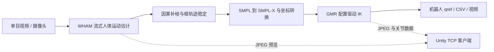

# Robot Imitation Learning

从单目 RGB 视频恢复人体三维运动，并通过 General Motion Retargeting
（GMR）生成不同人形机器人的运动学关节参考。`main` 分支现已包含完整的
WHAM + GMR 流式管线、稳定化与基准测试脚本，以及用于 Unity 可视化的
CSV/TCP 数据接口。

> 本项目输出的是运动学参考（`qref`），不包含真实机器人的平衡控制、
> 力矩控制或安全策略。部署到实体机器人前仍需闭环控制器和硬件验证。

## 演示

<table>
  <tr>
    <th>WHAM 在线人体运动恢复</th>
    <th>Unitree G1 动作重定向</th>
  </tr>
  <tr>
    <td></td>
    <td></td>
  </tr>
  <tr>
    <td><a href="docs/video/WHAM_REALTIME.mp4">播放或下载 MP4</a></td>
    <td><a href="docs/video/unitree_g1_hmr4d_results.mp4">播放或下载 MP4</a></td>
  </tr>
</table>

更多演示素材位于 [`docs/video`](docs/video)。

## 流程



## 主要功能

- 视频文件或摄像头输入的流式 WHAM 推理。
- 跨窗口根位移累积、稀疏帧补齐、姿态与高度稳定化。
- 配置驱动的 GMR 逆运动学，示例覆盖 Unitree G1 和 H1。
- 输出 PKL、CSV、WHAM 可视化和 MuJoCo 机器人视频。
- 可选 TCP 图像流，供 Unity 等外部可视化客户端接收。
- FPS、显存、稳定化消融和截图网格的一键基准脚本。

## 仓库结构

```text
.
├── handle_wham_gmr.py          # WHAM + GMR 端到端流式入口
├── run.sh                      # 常用运行参数封装
├── general_motion_retargeting/ # GMR 核心实现
├── configs/                    # WHAM 与机器人配置
├── assets/                     # 机器人模型和映射资源
├── scripts/                    # 离线转换与辅助脚本
├── docker/                     # Dockerfile、Compose 与安装脚本
├── docs/                       # 安装、API、数据与归档文档
└── docs/video/                 # Git LFS 管理的演示媒体
```

## 环境准备

推荐环境为 Ubuntu 22.04、Python 3.10、NVIDIA GPU 与 CUDA 11.3。

```bash
git lfs install
git clone https://github.com/2404412990/Robot-imitation-learning.git
cd Robot-imitation-learning
git lfs pull

conda create -n wham_gmr python=3.10 -y
conda activate wham_gmr
```

随后按照 [`docs/INSTALL.md`](docs/INSTALL.md) 安装 PyTorch、PyTorch3D、
ViTPose、DPVO 和本项目依赖。Docker 用户可参考
[`docs/DOCKER.md`](docs/DOCKER.md)。

运行前还需要准备 `checkpoints/`、数据和 `assets/body_models/`。项目组使用的
资源可从[百度网盘](https://pan.baidu.com/s/1fVf2eA1OzdRv70M4gm2wSA?pwd=8pnu)
下载；公开数据说明见 [`docs/DATASET.md`](docs/DATASET.md)。

## 快速开始

处理视频并输出 G1 重定向结果：

```bash
OUTPUT_ROOT=output/demo \
ROBOT=unitree_g1 \
VIDEO=examples/Walking.mp4 \
RECORD_WHAMVIDEO=1 \
RECORD_GMRVIDEO=1 \
bash run.sh
```

无显示器的服务器环境：

```bash
OUTPUT_ROOT=output/demo_headless \
ROBOT=unitree_h1 \
VIDEO=examples/Walking.mp4 \
USE_XVFB_GMR=1 \
RECORD_WHAMVIDEO=1 \
RECORD_GMRVIDEO=1 \
bash run.sh
```

摄像头输入时将 `VIDEO` 设为 `0`；可通过 `TIME=10` 指定采集秒数。

### 常用参数

| 参数 | 默认值 | 说明 |
| --- | --- | --- |
| `VIDEO` | `examples/IMG_9732.mov` | 视频路径；`0` 表示摄像头 |
| `ROBOT` | `unitree_g1` | 目标机器人配置 |
| `OUTPUT_ROOT` | 空 | 统一设置本次运行输出目录 |
| `RECORD_WHAMVIDEO` | `1` | 保存 WHAM 可视化结果 |
| `RECORD_GMRVIDEO` | `1` | 保存并显示 GMR 机器人结果 |
| `USE_XVFB_GMR` | `0` | 使用虚拟显示进行无头渲染 |
| `WHAM_USE_AMP` | `0` | CUDA 下启用半精度推理 |
| `WHAM_DETECT_INTERVAL` | `1` | 每 N 帧运行一次检测 |
| `WHAM_INFER_INTERVAL` | `1` | 每 N 帧运行一次完整 WHAM 推理 |
| `WHAM_STREAM_SEQ_LEN` | `16` | 流式时序窗口长度 |
| `GMR_MAX_ITER` | `5` | 每阶段 IK 最大迭代次数 |

完整参数说明见 [`docs/API.md`](docs/API.md) 和脚本内注释。

## 输出

设置 `OUTPUT_ROOT=output/demo` 后，主要结果位于：

```text
output/demo/
├── stream_demo/          # WHAM 流式结果与中间数据
├── pkl/my_motion.pkl     # 人体运动结果
├── csv/live_motion.csv   # Unity/外部客户端可读取的关节序列
└── video/live_stream_robot.mp4
```

如需 Unity 预览流，可直接运行 `handle_wham_gmr.py` 并添加 `--tcp`；默认监听
参数及数据格式以 [`handle_wham_gmr.py`](handle_wham_gmr.py) 中的
`TcpStreamSender` 为准。

## 基准测试

```bash
GPU_ID=0 \
ROBOT=unitree_g1 \
RESULTS=results/local \
bash run_all_benchmarks.sh
```

脚本会生成吞吐率、显存、稳定化消融、轨迹图和截图网格。运行前请确认
`examples/` 中存在对应测试视频。

## 文档

- [安装指南](docs/INSTALL.md)
- [Docker 使用](docs/DOCKER.md)
- [API 与运行参数](docs/API.md)
- [数据准备](docs/DATASET.md)
- [测试动作说明](docs/TEST_MOTIONS.md)
- [WHAM 说明](docs/wham.md)
- [GMR 说明](docs/gmr.md)
- [历史团队笔记](docs/archive/legacy-team-notes/README.md)

## 致谢与许可证

本仓库集成并扩展了 WHAM 与 General Motion Retargeting 等开源项目。请同时
遵守各第三方目录中的许可证和模型/数据集使用条款。项目代码采用
[`LICENSE`](LICENSE) 中列出的 MIT 许可与版权声明。
