# WHAM + GMR 系统架构图

```mermaid
flowchart TD
    %% ─── 输入层 ───
    subgraph INPUT["输入层"]
        CAM["摄像头 / 视频文件\nVIDEO=0 | path"]
    end

    %% ─── 读帧线程 ───
    subgraph READ_T["读帧线程  reader_thread()"]
        RESIZE["可选缩放\nWHAM_INPUT_SCALE"]
        READ_Q[("read_Q\nQueue")]
    end

    %% ─── 检测线程 ───
    subgraph DET_T["检测线程  detector_thread()"]
        YOLO["YOLO v8 目标检测\n+ ByteTracker 多目标追踪\n(每 DETECT_INTERVAL 帧)"]
        VITPOSE["ViTPose-Base\n2D 关键点检测\n(17 COCO joints, 256×192)"]
        DET_Q[("det_Q\nQueue")]
    end

    %% ─── 特征提取线程 ───
    subgraph EXT_T["特征提取线程  extractor_thread()"]
        VITFEAT["ViT 特征提取器\nimg_feature (2048-d)"]
        NORM["keypoints_normalizer\nnorm_kp2d (B,N,17,2)"]
        INIT_SMPL["SMPL 单帧初始化\ninit_pose / init_shape\n(用于首帧 LSTM 热启动)"]
        EXT_Q[("ext_Q\nQueue")]
    end

    %% ─── WHAM 推理线程 ───
    subgraph WHAM_T["WHAM 推理线程  wham_thread()"]
        direction TB

        subgraph WHAM_NET["WHAM Network  (lib/models/wham.py)"]
            direction TB
            PP["preprocess()\nmask_embedding 遮盖低置信关键点\n(B,F,17,2)"]
            ME["MotionEncoder\nLinear(37→512)\n+ LSTM×3 → motion_context\n预测 kp3d (B,F,17,3)"]
            TD_MOD["TrajectoryDecoder\nLSTM×3 → pred_root r6d\n→ pred_vel"]
            INTEG["Integrator\nFusion: motion_context + img_feature\n(B,F,2048+d_ctx → d_ctx)"]
            MD["MotionDecoder\nLSTM×3 → pred_pose (24×6d)\n→ pred_shape (10-d)\n→ pred_cam (3-d)"]
            TREF["TrajectoryRefiner\n足部接触约束\nΔroot + Δvel 修正"]
            SMPL_M["SMPL Model\npred_pose + pred_shape\n→ vertices + joints"]
            ROLLOUT["rollout_global_motion()\nr6d → rot matrix\n→ trans_world"]
        end

        PP --> ME
        ME --> TD_MOD
        ME --> INTEG
        INTEG --> MD
        MD --> SMPL_M
        TD_MOD --> TREF
        SMPL_M --> TREF
        SMPL_M --> ROLLOUT
        TREF --> ROLLOUT

        WHAM_Q[("wham_Q\nQueue")]
    end

    %% ─── GMR 后处理线程 ───
    subgraph GMR_T["GMR 重定向线程  gmr_thread()"]
        direction TB

        subgraph COORD["坐标变换"]
            YUP["WHAM Y-up → Z-up\n_tail_apply_yup_to_zup()\nR_x(90°) 变换"]
        end

        subgraph SMPLX_REBUILD["SMPL-X 重建"]
            SMPLX["smplx.create()\nbody_pose[:63] (21关节×3)\n+ global_orient + transl\n→ SMPL-X joint positions"]
        end

        subgraph GMR_NET["GeneralMotionRetargeting"]
            direction LR
            KM["KinematicsModel\n机器人运动学计算\nMuJoCo XML 加载"]
            IK["mink IK 求解器\n(daqp, 阻尼=5e-1)\n位置权重100 / 方向权重10\n→ robot joint angles"]
            SMOOTH["时序平滑\nalpha=SMOOTH_ALPHA(0.35)"]
        end

        subgraph POST["后处理  OnlineQposPostprocessor"]
            QPOS["qpos → 36-float CSV 行\n[root_pos(3) root_rot(4) dof(29)]"]
        end

        YUP --> SMPLX --> KM --> IK --> SMOOTH --> QPOS
    end

    %% ─── 输出层 ───
    subgraph OUTPUT["输出层"]
        direction LR
        CSV_F["live_motion.csv\n(36 floats/行)\nStartInput 轮询"]
        MJ["MuJoCo\n可视化窗口"]
        GMR_VID["gmr_视频录制\n(可选)"]
        WHAM_VID["wham_视频录制\n(可选 PyTorch3D)"]
        TCP_S["TCP 流\n127.0.0.1:9876\n→ Unity StreamReceiver"]
        PKL["pkl_outputs/\n*.pkl\nSMPL-X 完整序列"]
    end

    subgraph UNITY["Unity ML-Agents"]
        G1["G1mimicAgent\nArticulationBody PD drives\n29 DOF @ 50Hz"]
    end

    %% ─── 数据流连线 ───
    CAM --> RESIZE --> READ_Q
    READ_Q --> YOLO --> VITPOSE --> DET_Q
    DET_Q --> VITFEAT
    DET_Q --> NORM
    DET_Q --> INIT_SMPL
    VITFEAT & NORM & INIT_SMPL --> EXT_Q

    EXT_Q --> PP
    ROLLOUT --> WHAM_Q

    WHAM_Q --> YUP
    QPOS --> CSV_F
    QPOS --> MJ
    QPOS --> GMR_VID
    ROLLOUT --> WHAM_VID
    WHAM_Q --> TCP_S
    SMPL_M --> PKL

    CSV_F --> G1

    %% ─── 控制流 run.ps1 / run.sh ───
    subgraph RUN["run.ps1 / run.sh  (入口)"]
        ENV_VARS["环境变量注入\nROBOT / VIDEO / WHAM_USE_AMP\nDETECT_INTERVAL / INFER_INTERVAL\nSMOOTH_ALPHA / OUTPUT_ROOT ..."]
    end

    RUN --> |"subprocess 启动\nhandle_wham_gmr.py"| INPUT

    %% ─── 可选 SLAM ───
    subgraph SLAM["可选: DPVO SLAM"]
        DPVO["DPVO 全局相机运动\ncam_angvel (6-d)\n(需 CUDA 11.3 + Eigen)"]
    end

    READ_Q -.->|"原始帧(可选)"| DPVO
    DPVO -.->|"cam_angvel → TrajectoryDecoder"| TD_MOD

    %% ─── 样式 ───
    classDef thread fill:#1a3a5c,stroke:#4a8ab5,color:#e0f0ff
    classDef queue fill:#2d4a1e,stroke:#5a8a3c,color:#d0f0c0
    classDef model fill:#3a1a5c,stroke:#8a4ab5,color:#f0d0ff
    classDef output fill:#4a2a1a,stroke:#b57a4a,color:#ffe0c0
    classDef input fill:#1a4a3a,stroke:#4ab58a,color:#d0ffe0
    classDef optional stroke-dasharray: 5 5,fill:#2a2a2a,stroke:#888,color:#ccc

    class READ_T,DET_T,EXT_T,WHAM_T,GMR_T thread
    class READ_Q,DET_Q,EXT_Q,WHAM_Q queue
    class WHAM_NET,GMR_NET,SLAM model
    class OUTPUT,UNITY output
    class INPUT,RUN input
    class SLAM optional
```



---

## 线程模型与队列

```
reader_thread  →[read_Q]→  detector_thread  →[det_Q]→  extractor_thread  →[ext_Q]→  wham_thread  →[wham_Q]→  gmr_thread
                                                                                                               ↓
                                                                                                        render_thread (MuJoCo)
```

| 队列 | 生产者 | 消费者 | 内容 |
|------|--------|--------|------|
| `read_Q` | `reader_thread` | `detector_thread` | `(frame_id, timestamp, frame_bgr)` |
| `det_Q` | `detector_thread` | `extractor_thread` | `(frame_id, ts, frame, track_id, kp2d, bbox)` |
| `ext_Q` | `extractor_thread` | `wham_thread` | `(frame_id, ts, frame, track_id, hist_dict)` |
| `wham_Q` | `wham_thread` | `gmr_thread` | `(frame_id, ts, frame, success, verts, track_id, smplx_params)` |

---

## 张量维度速查

| 变量 | 形状 | 说明 |
|------|------|------|
| `norm_kp2d` | `(1, N, 17, 2)` | 归一化 2D 关键点，WHAM 输入 x |
| `img_feature` | `(1, N, 2048)` | ViT 图像特征 |
| `mask` | `(1, N, 17)` | 低置信关键点遮罩 (conf < 0.3) |
| `cam_angvel` | `(1, N, 6)` | 相机角速度 (DPVO 提供或置零) |
| `pred_pose` | `(1, N, 24×6)` | SMPL 24 关节 6D 旋转 |
| `pred_shape` | `(1, N, 10)` | SMPL β 形状参数 |
| `pred_cam` | `(1, N, 3)` | 弱透视相机参数 |
| `trans_world` | `(1, N, 3)` | 世界坐标系根节点位移 |
| `robot_qpos` | `(36,)` | CSV 行：pos(3)+quat(4)+DOF(29) |
